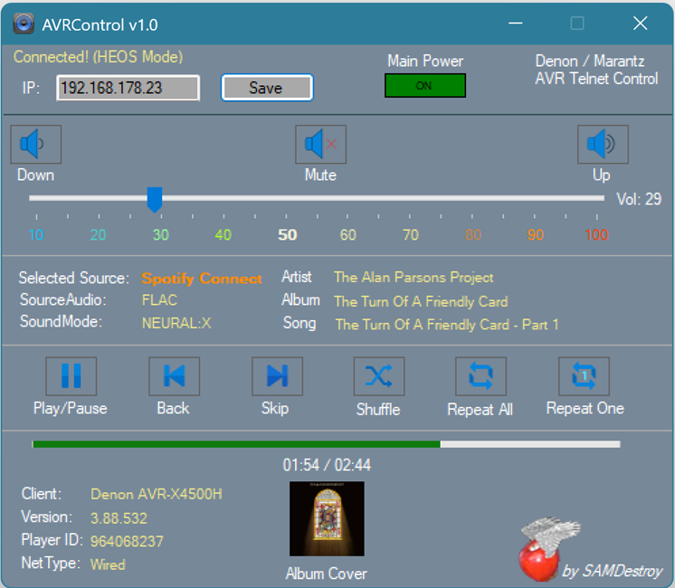

# AVRControl

A lightweight C# Windows Forms tool for basic Telnet control of Denon and Marantz AVRs.

## Overview
AVRControl is a portable application designed for quick and easy control of your AV Receiver directly from your Windows desktop.
No installation required.

### Features
*   *Permanent Telnet Connection:* Real-time status updates and basic controls.
*   *HEOS Support:* Automatically establishes a permanent HEOS telnet connection when a network stream is active.
*   *Source Naming:* Uses an XML Parser to fetch the "Friendly Name" of the current input source.
*   *Portable:* Run it from any folder. Settings are stored in a local AVRControl.cfg.
*   *Compatibility:* Successfully tested on *Windows 11 24H2*.

## Requirements
*   *Operating System:* Windows 10 / 11.
*   *AVR Settings:* You *must* enable "Network Control / IP Control" on your AVR:
    *   Setup -> Network -> Network Control -> Set to "ON" or "Always On".
*   *Network:* Your PC and AVR must be in the same network.

## How to use
1.  Download the latest build from the [Releases] tab.
2.  Start AVRControl.exe.
3.  Enter the *IP Address* of your AVR.
4.  Click *Save*.
5.  The tool connects automatically and saves your IP in AVRControl.cfg.

## License
This project is licensed under the GPU V3 License. See the LICENSE file for details.
This means you are free to use, modify, and distribute the software, provided that the original copyright notice is included.

---
Created for personal needs – I hope you find it useful!

cya
SAMDestroy
