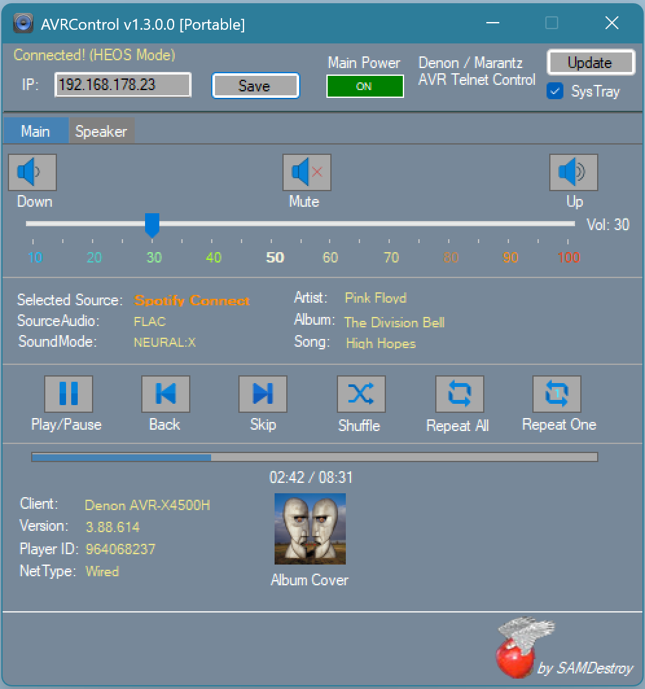
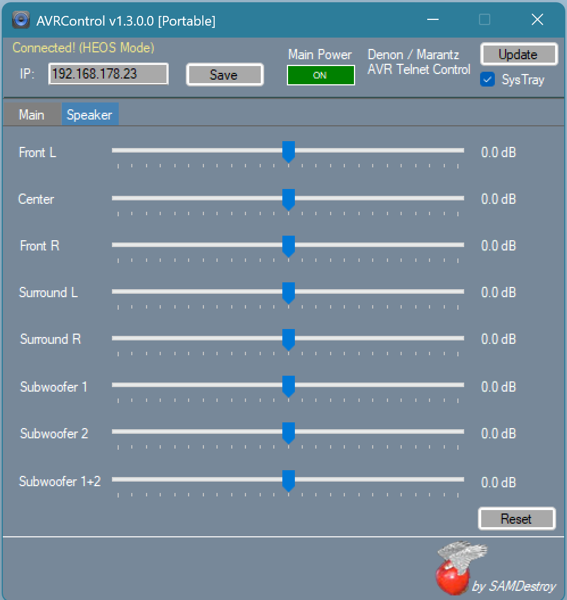

# AVRControl

A lightweight C# Windows Forms tool for basic Telnet control of Denon and Marantz AVRs.
Tested on Denon X4500H with 5.1 Audyssey Setup

## Overview
AVRControl is a portable application designed for quick and easy control of your AV Receiver directly from your Windows desktop.
No installation required.

### Features
*   **Permanent Telnet Connection:** Real-time status updates and basic controls.
*   **HEOS Support:** Automatically establishes a permanent HEOS telnet connection when a network stream is active.
*   **Source Naming:** Uses an XML Parser to fetch the "Friendly Name" of the current input source.
*   **Portable:** Run it from any folder. Settings are stored in a local AVRControl.cfg.
*   **Compatibility:** Successfully tested on *Windows 11 24H2*.

## Requirements
*   **Operating System:** Windows 10 / 11.
*   **AVR Settings:** You *must* enable "Network Control / IP Control" on your AVR:
*   Setup -> Network -> Network Control -> Set to "ON" or "Always On".
*   **Network:** Your PC and AVR must be in the same network.

## How to use
1.  Download the latest build from the [Releases] tab.
2.  Start AVRControl.exe.
3.  Enter the *IP Address* of your AVR.
4.  Click *Save*.
5.  The tool connects automatically and saves your IP in AVRControl.cfg.

CHANGELOG:

🚀 **AVRControl v1.3.0 – The Visual Precision Update**
This release introduces a completely redesigned, lag-free playback engine and a surgical fix for the most persistent Windows UI bugs.

✨ **New Features**

- **High-Performance Progress Engine:** Replaced the legacy Windows Progress Bar with a custom-engineered Dual-Panel Progress System. This provides a rock-solid, non-animated, and frame-perfect visual representation of your music playback.
- **Aesthetic:** The new progress bar features a clean, high-contrast design, eliminating the distracting "Windows Green Glow" for a focused, modern interface.
- **Zero-Latency Timecode:** Optimized the synchronization between the local 100ms timer and the HEOS Telnet pulse. The playback bar now glides smoothly without the typical "jumping" seen in standard OS controls.

🛠️ **Technical Improvements**

- **Intelligent Metadata Guard:** Implemented a new State-Pending Logic for HEOS events. The app now distinguishes between a real track change and background metadata updates (like covert art refreshes), preventing accidental progress resets.
- **Smart Plausibility Filter:** Introduced a "Ghost-Zero" protection that filters out invalid 0ms-timecodes often sent by the AVR during network jitter, ensuring the timeline remains stable even under unstable conditions.
- **Engineered Rendering:** Switched to a manual width-calculation rendering for the playback bar. This bypasses the heavy Windows GDI+ animation engine, drastically reducing UI overhead and flickering.

🐛 **Bugfixes**
- **Fixed:** Resolved the "Middle-of-Song Jump" where the progress bar would occasionally reset to 0:00 during active playback due to misinterpreted HEOS change-events.
- **Fixed:** The "Vanishing Icon" bug is now permanently addressed through a new Handle-Created Master Fix and Icon-Cloning. The app icon now remains anchored in the taskbar even after DPI changes or deep sleep cycles.
- **Fixed:** Corrected a UI-layering issue where the time-label would occasionally become obscured by the progress background.

**Developer Note:**
The transition from a standard ProgressBar to a custom Panel-based system was necessary to overcome native Windows limitations. This update marks a significant step towards a professional-grade desktop controller with 100% visual reliability.

## License
This project is licensed under the GPU V3 License. See the LICENSE file for details.
This means you are free to use, modify, and distribute the software, provided that the original copyright notice is included.

---
Created for personal needs – I hope you find it useful!

cya
SAMDestroy
