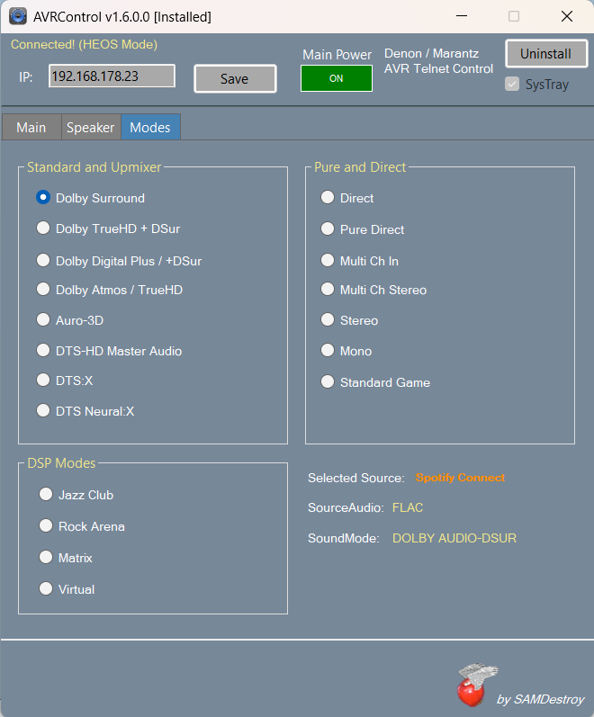

# AVRControl

A lightweight C# Windows Forms tool for basic Telnet control of Denon and Marantz AVRs.
Tested on Denon X4500H with 5.1 Audyssey Setup

## Overview
AVRControl is a portable application designed for quick and easy control of your AV Receiver directly from your Windows desktop.
No installation required.

### Features
*   **Permanent Telnet Connection:** Real-time status updates and basic controls.
*   **HEOS Support:** Automatically establishes a permanent HEOS telnet connection when a network stream is active.
*   **Source Naming:** Uses an XML Parser to fetch the "Friendly Name" of the current input source.
*   **Portable:** Run it from any folder. Settings are stored in a local AVRControl.cfg.
*   **Compatibility:** Successfully tested on *Windows 11 24H2*.

## Requirements
*   **Operating System:** Windows 10 / 11.
*   **AVR Settings:** You *must* enable "Network Control / IP Control" on your AVR:
*   Setup -> Network -> Network Control -> Set to "ON" or "Always On".
*   **Network:** Your PC and AVR must be in the same network.

## How to use
1.  Download the latest build from the [Releases] tab.
2.  Start AVRControl.exe.
3.  Enter the *IP Address* of your AVR.
4.  Click *Save*.
5.  The tool connects automatically and saves your IP in AVRControl.cfg.

Changelog

🚀 **AVRControl v1.6.0.0 – The Advanced Audio Matrix Release**
* This release introduces a completely redesigned **Audio Modes Matrix**, giving you full, real-time command over 16 distinct sound formats of your Denon/Marantz AVR.
* The entire system has been heavily refined to ensure absolute, instant synchronization between what you see on your monitor and what your receiver is actually doing.

✨ **New Features**

* **Advanced Audio Modes Matrix:** A beautiful, newly integrated tab page splitting 16 dedicated audio modes into clean, logical categories (Standard/Upmixers, Purist Modes, and DSP Environments). 
* **Real-Time Format Synchronization:** The active selection snaps into place instantly, reflecting the AVR's true state. If you switch inputs or formats, the app follows immediately.
* **Flicker-Free UI Rendering:** Re-engineered how the user interface redraws itself. Changing modes or receiving heavy background status updates now happens completely silently and without visual flickering.
* **Expanded Audio Format Coverage:** Full native UI support for cinema and streaming audio formats, including Dolby TrueHD + DSur, Dolby Atmos, DTS-HD Master Audio, native DTS:X, and streaming-centric Dolby Digital Plus (`DD+DSUR`).

🛠️ **Technical Improvements**

* **Modernized Network Stack:** Fully overhauled the background update-check and XML parsing engines to run completely non-blocking, ensuring a lighter network footprint and smoother app performance.
* **High-DPI Display Precision:** Enabled advanced screen scaling, ensuring that the interface and fonts remain sharp on high-resolution displays.
* **Small Repository:** Completely purged obsolete legacy dependencies and old configuration files from the backend, leaving a significantly lighter and cleaner application footprint.

🐛 **Bugfixes**

* **Fixed:** Resolved a synchronization bug where forcing incompatible audio modes could leave the app out of sync with the physical receiver.
* **Fixed:** Extended the text normalization engine to prevent complex audio stream names from dropping selection points.
* **Fixed:** Eliminated redundant interface redraws to keep background resource usage near zero percent during long movie or music sessions.

**Developer Note:**

* v1.6.0.0, focused heavily on bridging the real-time feedback of the AVR with the Windows Forms interface. While optimizing for the cutting-edge **.NET 10 SDK**, intentionally chose to halt automatic Roslyn code refactoring beyond essential cleanups. Modern compiler suggestions frequently advocate for highly abstracted, compressed syntax rules (such as range indices `data[2..]` or advanced inline shortcuts) that heavily degrade immediate human code readability. 
* Initially attempted to clear every single code analysis message, but ultimately drew the line to protect the project's clarity. To preserve AVRControl as a deeply transparent, easily maintainable, and community-friendly open-source project, explicit readability was prioritized over purely academic compiler micro-optimizations. Code should be clean, but above all, it must remain human-readable.

**License**

This project is licensed under the GPL V3 License. See the LICENSE file for details.
This means you are free to use, modify, and distribute the software, provided that the original copyright notice is included.

Created for personal needs – I hope you find it useful!
cya
SAMDestroy