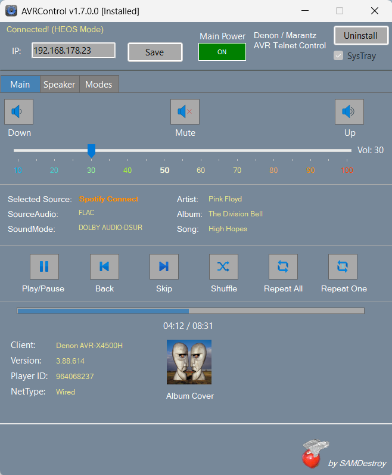
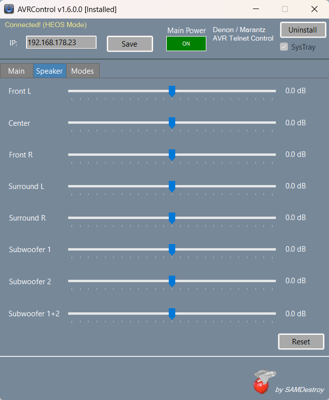

# AVRControl

A lightweight C# Windows Forms tool for basic Telnet control of Denon and Marantz AVRs.
Tested on Denon X4500H with 5.1 Audyssey Setup

## Overview
AVRControl is a portable application designed for quick and easy control of your AV Receiver directly from your Windows desktop.
No installation required.

### Features
*   **Permanent Telnet Connection:** Real-time status updates and basic controls.
*   **HEOS Support:** Automatically establishes a permanent HEOS telnet connection when a network stream is active.
*   **Source Naming:** Uses an XML Parser to fetch the "Friendly Name" of the current input source.
*   **Portable:** Run it from any folder. Settings are stored in a local AVRControl.cfg.
*   **Compatibility:** Successfully tested on *Windows 11 24H2*.

## Requirements
*   **Operating System:** Windows 10 / 11.
*   **AVR Settings:** You *must* enable "Network Control / IP Control" on your AVR:
*   Setup -> Network -> Network Control -> Set to "ON" or "Always On".
*   **Network:** Your PC and AVR must be in the same network.

## How to use
1.  Download the latest build from the [Releases] tab.
2.  Start AVRControl.exe.
3.  Enter the *IP Address* of your AVR.
4.  Click *Save*.
5.  The tool connects automatically and saves your IP in AVRControl.cfg.

CHANGELOG:

🚀 **AVRControl v1.5.0 – The Resilience & Recovery Update**
This major update focuses on "Bulletproof Synchronization." We’ve re-engineered the communication core to ensure the app remains perfectly synced, even after laptop sleep cycles or critical network watchdog events.

✨ **New Features**

* **Self-Healing UI Architecture:** The playback interface now features "Instant-Recovery" logic. If the app wakes up from standby, it no longer waits for a song change to refresh. It actively heals the timeline, progress bar, and metadata labels within milliseconds of reconnection.
* **Persistent Service Guardian:** Introduced a secondary metadata layer that prevents the AVR from overwriting specific streaming service names (like Spotify or TuneIn) with the generic "HEOS" label. Your source display now correctly maintains its "Higher Truth" metadata.
* **Dynamic Playback Synchronization:** The UI now intelligently distinguishes between "System Pause" and "Network Lag," ensuring the timer only runs when the hardware actually moves, providing a 100% reliable representation of the current playback state.

🛠️ **Technical Improvements**

* **Asynchronous Telnet Core 2.0:** Heavily optimized the underlying Telnet client with SemaphoreSlim for thread-safe command queuing and a dedicated StringBuilder buffer to handle TCP fragmentation. This ensures no command or response is lost during high-traffic updates.
* **Fail-Safe Timer Engine:** Re-engineered the internal 100ms clock. The engine now enters a "Smart Idle" mode instead of self-terminating when the AVR is temporarily unreachable, allowing for a seamless resume without manual intervention.
* **Decoupled Port Logic:** Fully separated the Hardware-State (Port 23) from the Content-State (Port 1255). This decoupling eliminates race conditions where one port would "choke" the other during simultaneous reconnection attempts.

🐛 **Bugfixes**

* **Fixed:** Resolved the "Frozen Timeline" bug where the progress bar would stop animating and the time-label would go empty after the laptop resumed from sleep.
* **Fixed:** Corrected the "Source-Name Race Condition" where the AVR would repeatedly overwrite the active streaming service name with a generic "HEOS" string.
* **Fixed:** Eliminated the "Suicidal Timer" glitch, where the playback engine would permanently stop if the AVR’s status response was delayed by a few milliseconds during a watchdog reset.
* **Fixed:** Improved TCP Framing to prevent misinterpreted HEOS JSON strings caused by fragmented network packets.

**Developer Note:**
v1.5.0 is all about reliability. By moving away from a "fragile" state-machine to a "self-healing" architecture, AVRControl can now survive network jitter and system power states that would crash standard Telnet implementations. This version represents the most stable release to date.

## License
This project is licensed under the GPU V3 License. See the LICENSE file for details.
This means you are free to use, modify, and distribute the software, provided that the original copyright notice is included.

---
Created for personal needs – I hope you find it useful!

cya
SAMDestroy
